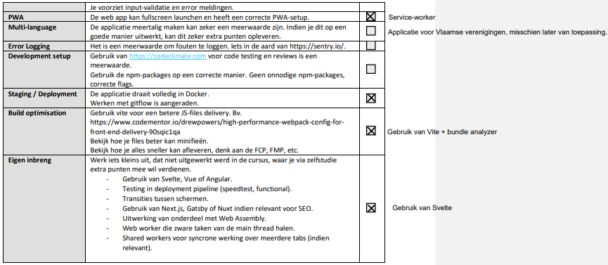

# KassAapje

KassAapje is een Point-Of-Sale Applicatie bedoeld voor verenigingen zoals jeugdhuizen, studentenclubs, vzw's...
Het bevat de mogelijkheid om een vereniging aan te maken en daarbinnen meerdere kassa's te beheren (bv. een kassa voor de bar, een evenement...).

## Praktische Elementen
### Gewenste Functionaliteiten
* Een vereniging aanmaken (door guests)
* Een kassa aanmaken en beheren
* Catalogus raadplegen en beheren
* Opdeling in rollen
  * Vereniging Admin: Kassa's beheren, bewerkingen uitvoeren
  * Kassa Admin: Eigen kassa beheren, catalogus bewerken
  * Kassa Gebruiker/Verkoper: Enkel dingen uit catalogus verkopen (bewerkingen voorstellen maar niet uitvoeren)maar niet uitvoeren)
* Verschillende productopties
  * Varianten zoals maat/kleur/...
  * Verschillende prijzen per variant
  * EXTRA: Voorraad beheren?
  * EXTRA: Nabestelling toestaan?
* EXTRA: Verschillende betaalmethoden (zelf toe te voegen)
  * bv. Payconic, overschrijving, cash...
* EXTRA: Verschillende afrekenmogelijkheden
  * Bestelling op naam
  * Anonieme klant
* EXTRA: Opvolgen van betalingen
  * Betaling op pending tot de admin bevestigt

### Technische structuur
* Frontend: Svelte
* Backend: Express (Node.js)
* Database: MariaDB
* GraphQL voor API calls

### Passwords
* Database: 
  * User: admin
  * Password: strong_password
* Admin Gebruiker:
  * User: docent@howest.be
  * Password: P@ssw0rd
* Gewone Kassa gebruiker:
  * User: gebruiker@howest.be
  * Password: P@ssw0rd

### IP adressen
- **Lokaal - Development**
  - Backend http://localhost:8888/
  - Frontend http://localhost:3000/
- **Schoolnetwerk - Production (k8s)**
  - Backend http://localhost:30201/
  - Adminer http://localhost:30299/
  - Frontend http://localhost:30280/

### Team Verdeling
* Karel Bousson
  * Focus op backend 
* Ibe Verbeke
  * Focus op frontend

### ER Diagram

## Milestones
### Gepasseerd
22 Oktober: ER-Diagram + Design in XD + Trello-Board
29 Oktober: Basic routes in backend (CRUD-acties) + First layout frontend
👎 Niet gelukt, lastiger dan voorspeld: lessenachterstand Karel etc.

ℹ STATUS 21/11:
- 🅱 Alle entities aangemaakt in de backend en GraphQL toegevoegd. Je kan al organisaties ophalen.
- 💻 Design in XD, nog niet af.

ℹ UPDATE 21/12:
- Backend presentatieklaar.
  - Wordt volledig automatisch op k8s gedeployed m.b.v. Github Actions.
  - Alles van de checklist voor project kan afgevinkt worden (uitgez. Rancher)
- Frontend nog een kleine ramp.
  - Uitstel gehad voor de presentatie, gezien de grote hoeveelheid werk nog na achterstand en sukkelen op bepaalde stukken van Frontend.

### Nog te komen
Week van 10 januari: presentatie

## Rapportering
### Checklists

  

### Werktijden
We zijn niet echt consistent geweest in het tracken van onze tijden, het waren rare tijden de laatste maanden en we hebben een tijdje alles getoggled, maar zijn het dan vergeten.

Op het einde van het project (voor de oorspronkelijke), waren we de hele dag aan het programmeren en dachtten we er niet aan om te togglen.

Ook in de kerstvakantie, na uitstel, hebben we niet echt meer getoggled, maar wel een groot deel van de dag telkens gewerkt.

Het was dus nogal chaotisch in ons hoofd...
We kunnen dus jammer genoeg geen deftig toggl verslag afleveren.

### Grootste behaalde succes
**Karel:**
- Na een zwaar handtrauma terug kunnen programmeren.
- Alsook de backend en de app volledig in k8s kunnen deployen. Het kostte veel zweet (en bijna tranen) maar is uiteindelijk gelukt (nog voor de oorspronkelijke deadline).

**Ibe:**
- Kunnen werken met Svelte, wat we nog niet kenden.

**Samen:**
- Van bijna niets op de frontend (buiten wat CSS) naar een MVP kunnen gaan met een maandje extra uitstel.

### Grootste moeilijkheid
**Karel:**
- k8s
- Lessen inhalen en terwijl aan project werken.
- De eerste paar dagen in Svelte

**Ibe:**
- Design & CSS
- Planning

**Samen:**
- Frontend 😅

### Extra's
**Backend:**
- Parameter decorators & middleware voor auth (o.a. @CurrentUser om huidige gebruiker op te halen)
- Rollensysteem + meegeven in firebase claims (encoded in string vorm)
  - *ORGID1/u,ORGID2/\*_REGID1/u*
  - u = user / * = owner ...
  - _ als separator organisaties/kassa's
- Logging van fouten: gebruiker + fout met leesbare foutmeldingen

**Frontend:**
- Geen zotte extra's, wel Svelte gebruikt.
- Service worker op app als PWA te kunnen gebruiken.